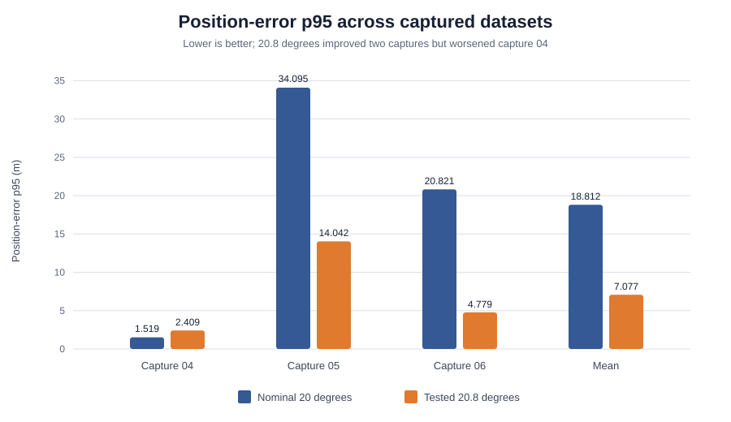

# Diagnosing Why OpenVINS Was Not Safe to Fly

> **Outcome:** I built a reproducible visual-inertial odometry evaluation and
> live-integration pipeline, reduced position-error p95 by 77% on the primary
> offline replay, and still rejected the estimator for control because it did
> not meet the accuracy or repeatability required for flight.

This case study covers an unsuccessful OpenVINS deployment in the AIGP drone
racing stack. The vehicle did not complete the competition objective using
OpenVINS. The useful result was the engineering process around that failure:
instrumenting the estimator, separating estimator inputs from audit truth,
running controlled experiments, checking software determinism, and allowing
safety gates to stop live runs whose state estimates were not credible.

| Project profile | Detail |
| --- | --- |
| Role | Autonomy software and state-estimation integration |
| Scope | Sensor capture, replay preparation, C++ estimator runner, diagnostics, controlled experiments, and runtime safety |
| Stack | Python, C++, Bash, OpenVINS, OpenCV, MAVLink, WSL, and PX4/Gazebo capture data |
| Evidence period | July-August 2026 |
| Final status | Offline research pipeline retained; control deployment rejected |

## At a glance

| Measure | Nominal 20-degree tilt | Best tested 20.8-degree tilt | Verdict |
| --- | ---: | ---: | --- |
| Primary-replay position-error p95 | 20.821 m | 4.779 m | 77.0% better, still a fail |
| Primary-replay final position error | 20.578 m | 5.682 m | 72.4% better, still a fail |
| Three-capture mean position-error p95 | 18.812 m | 7.077 m | Improved, not control-ready |
| Three-capture worst position-error p95 | 34.095 m | 14.042 m | Generalization remained poor |
| First error above internal 0.5 m target | -- | 8.498 s | Too early for closed-loop use |
| Software replay audit | Not run | 5/5 byte-identical | Reproducible on one build and machine |
| Live competition objective | -- | Not completed | Deployment failed |

The 0.5 m value is an internal control-readiness target used by this project,
not a published competition requirement.



The plot makes the central limitation visible: 20.8 degrees was much better
on captures 05 and 06, but it was worse than the nominal calibration on
capture 04. The experiment found a useful sensitivity, not a universally
correct calibration.

## The problem

The AIGP stack could fly simulated race trajectories when a trusted position
source was available. The competition path required a local state estimate
from synchronized camera and IMU measurements instead. I integrated OpenVINS
as the experimental visual-inertial estimator, with the longer-term goal of
replacing simulator truth in the control loop.

This was more than a library-integration problem. A state estimator can
initialize, publish plausible-looking values, and consume visual updates while
still drifting too far for a controller. The acceptance question was therefore
not "does OpenVINS run?" It was "does the resulting state remain accurate and
stable enough to control the vehicle, across more than one capture?"

## What I built

The work produced an end-to-end diagnostic path:

```text
MAVLink camera + IMU capture
             |
             v
clock alignment, unit/axis conversion, and replay manifest
             |
             v
non-ROS OpenVINS runner in WSL
             |
             +--> state estimates
             +--> MSCKF rejection funnel
             +--> per-feature geometry
             +--> persistent-SLAM diagnostics
             |
             v
startup-frame alignment and truth-based audit only after estimation
             |
             v
controlled sweeps, drift classification, determinism audit, go/no-go decision
```

The main implementation pieces are:

- [`prepare_openvins_dataset.py`](../../../aigp/tools/prepare_openvins_dataset.py),
  which validates a capture, aligns sensor clocks, converts units and axes,
  brackets camera updates with IMU samples, and records assumptions in a
  manifest.
- [`run_vq1_dataset.cpp`](../../../aigp/openvins/runner/run_vq1_dataset.cpp), a
  non-ROS replay runner that writes estimates and diagnostic CSVs and fails
  explicitly on configuration, image-decoding, or initialization errors.
- [`build_and_run_vq1.sh`](../../../aigp/openvins/build_and_run_vq1.sh), which
  applies the local OpenVINS instrumentation patches and builds and runs a
  named replay without overwriting other experiments.
- [`diagnose_openvins_replay.py`](../../../aigp/tools/diagnose_openvins_replay.py)
  and [`audit_openvins_drift.py`](../../../aigp/tools/audit_openvins_drift.py),
  which turn estimator output into sensor, update, trajectory, and failure
  reports.
- [`audit_replay_determinism.sh`](../../../aigp/openvins/audit_replay_determinism.sh),
  which executes isolated copies of one prepared replay and compares the
  output hashes.
- OpenVINS patches under [`aigp/openvins/patches`](../../../aigp/openvins/patches),
  which expose initializer failures, MSCKF rejection stages, feature geometry,
  and geometry-ranked selection rather than reducing the result to a single
  trajectory CSV.

This instrumentation mattered because it separated three very different
failure modes: bad sensor preparation, visual constraints that never reached
the filter, and an estimator that updated successfully but still accumulated
unacceptable state error.

## Evaluation design

### Data boundary

The primary experiment used capture `vq1_openvins_yexcite_noperception_06`:
5,119 IMU rows and 670 selected camera rows. The tested configuration used 30
clones, camera stride 2, a 10-feature MSCKF update cap, geometry-ranked
selection, 100 persistent SLAM landmarks, the red image channel, 500 features,
a FAST threshold of 15, 7 px feature spacing, stationary initialization, and
an audited maximum raw IMU gap of 120 ms.

Captures 04 and 05 provided a limited cross-capture check of the most promising
tilt values. They were existing captures, not a fresh randomized benchmark.

### Truth separation

Recorded position and attitude truth were **not fed to OpenVINS**. Truth was
used only after replay for:

1. one rigid alignment at the first OpenVINS output; and
2. evaluation metrics and diagnostic audits.

No trajectory-wide pose fit or scale fit was fed back to the estimator. One
counterfactual constant-scale fit was calculated for diagnosis only. This
distinction is important: these are truth-scored offline results, not a
truth-assisted estimator.

### Metrics and acceptance

The primary metric was the 95th percentile of startup-aligned position error.
I also tracked final error, maximum error, endpoint and path scale, speed
ratio, velocity-direction error, heading error, and tilt-attitude error.

For control readiness, the project used a 0.5 m p95 position target and a
1.0 m maximum-error target in the gate-alignment audit. An experiment could be
informative without passing either threshold, but it could not be promoted to
the live control path.

## Establishing the baseline

At the nominal 20-degree upward camera mounting pitch, the primary replay
initialized and completed, but produced 20.821 m position-error p95 and
20.578 m final error. The endpoint scale was 1.122 and path scale was 1.215,
which suggested a metric inconsistency, but the error could also contain
directional, timing, attitude, or bias components.

The key observation was that successful initialization and continued state
publication did not imply usable localization. The diagnostic report still
failed the replay for material velocity divergence.

## Controlled experiment 1: camera-to-IMU tilt

I tested whether the nominal camera mounting pitch explained part of the
drift. Only the rotation in `T_imu_cam` changed. Images, IMU samples,
timestamps, intrinsics, principal point, zero distortion, zero lever arm,
initialization, and every estimator setting remained fixed.

The [complete primary-run sweep](run06-tilt-sweep.csv) covered 10 to 30 degrees
and found a sharp local minimum near 20.8 degrees:

| Tilt | Position p95 | Final error | Endpoint scale | Velocity-direction p95 |
| ---: | ---: | ---: | ---: | ---: |
| 20.0 degrees | 20.821 m | 20.578 m | 1.122 | 6.60 degrees |
| 20.5 degrees | 6.240 m | 6.813 m | 1.023 | 4.85 degrees |
| **20.8 degrees** | **4.779 m** | **5.682 m** | **0.997** | **5.00 degrees** |
| 21.0 degrees | 10.174 m | 10.322 m | 0.951 | 5.11 degrees |

Relative to 20 degrees, 20.8 degrees reduced p95 error by 77.0% and final
error by 72.4%. Endpoint scale moved close to one. However, a diagnostic-only
best constant scale of 1.002 changed p95 only from 4.779 m to 4.755 m. The
remaining error was therefore not something a single scale multiplier would
fix.

### Cross-capture check

I replayed 20, 20.5, and 20.8 degrees on captures 04, 05, and 06 with all
other settings held fixed. The [cross-capture data](cross-capture-tilt-results.csv)
showed:

| Capture | 20 degrees | 20.5 degrees | 20.8 degrees | Best for that capture |
| --- | ---: | ---: | ---: | --- |
| 04 | **1.519 m** | 2.617 m | 2.409 m | 20 degrees |
| 05 | 34.095 m | 14.924 m | **14.042 m** | 20.8 degrees |
| 06 | 20.821 m | 6.240 m | **4.779 m** | 20.8 degrees |
| Mean | 18.812 m | 7.927 m | **7.077 m** | 20.8 degrees |

This supported a narrower claim: the nominal extrinsic was a material
contributor to error in two captures, and 20.8 degrees was the best tested
candidate by mean and worst-case p95. It did not support the claim that 20.8
degrees was the physical calibration. Capture 04 was already much better at
20 degrees, and the worst 20.8-degree replay still reached 14.042 m p95.

## Controlled experiment 2: focal length

I separately varied `fx=fy` while holding the principal point, images, IMU,
timing, initialization, and estimator settings fixed. Every case initialized
and produced 576 aligned estimates.

The [focal-length sweep](focal-length-sweep.csv) found a lowest p95 of 18.610 m
at 325 px, only 10.6% below the native 320 px result. Path scale was essentially
unchanged, velocity-direction p95 worsened from 6.60 to 8.40 degrees, heading
p95 worsened from 2.49 to 3.87 degrees, and many other focal values diverged
badly.

I rejected the 325 px result. It was a single-run sensitivity result with
worse secondary metrics, not evidence that the native focal length was wrong.
This negative experiment narrowed the likely root cause without creating a
new default.

## Proving software replay determinism

A sharp response to a small parameter change is not useful if the replay
itself changes between executions. I ran the exact prepared 20.8-degree
primary dataset five times in isolated directories. Four output files were
byte-identical across all five runs and matched the original replay:

| Output | Rows including header | Result |
| --- | ---: | --- |
| `openvins_estimate.csv` | 577 | Identical |
| `openvins_update_diagnostics.csv` | 671 | Identical |
| `openvins_feature_geometry.csv` | 9,267 | Identical |
| `openvins_slam_feature_diagnostics.csv` | 3,293 | Identical |

The exact SHA-256 values are in the
[determinism summary](determinism-summary.csv). This establishes deterministic
software output for one prepared dataset, build, and machine. It does not
establish repeatability across new captures, initialization conditions,
OpenVINS versions, operating systems, or hardware.

## What the residual error said

The best primary replay still failed its diagnostic report. Its first 0.5 m
position error occurred at 8.498 s, its first 2 m error at 18.434 s, and it
ended at 5.682 m error. The drift decomposition classified the result as
`scale_present_but_not_sufficient` and recommended investigating time-varying
direction and bias errors before applying a single scale correction.

Across the replay, the error was more cross-track than along-track:
cross-track error had a 4.771 m p95, compared with 2.685 m p95 absolute
along-track error. That helped explain why an endpoint scale close to one did
not make the trajectory safe.

## Why gate alignment did not rescue the baseline

I also evaluated an experimental translation-only correction built from YOLO
gate detections and PnP estimates on the nominal 20-degree replay. Truth was
not fed to the detector or aligner; it was used for scoring and PnP audit.

The aligner initialized and accepted 123 updates, but those updates covered
only two of six configured gates. The aligned position-error p95 was 22.448 m,
worse than the raw startup-aligned p95 of 20.821 m. Final error increased from
20.578 m to 22.195 m, and velocity-error p95 was 1.802 m/s. Even though the
audit associated all 272 gated PnP samples with the correct configured gate,
the correction itself was not accurate or observable enough for control.

The report marked `usable_for_control=false`. Correct association alone did
not compensate for inaccurate geometry and accumulating VIO drift.

## Live integration and competition outcome

The live bridge demonstrated that synchronized measurements could reach
OpenVINS and states could return to the Python runtime. In one later
competition-mode integration run, the bridge recorded 2,094 IMU inputs, 561
camera inputs, 377 returned states, and zero queue drops. The planner emitted
a crossed-gate-plane event for debug gate 0, then the divergence watchdog
detected 28.9 degrees of yaw disagreement at 1.7 m/s and disarmed the vehicle.

That was not a successful autonomous gate result. The live test used a known
debug gate map (`allow_ground_truth=1`), so it did not demonstrate truth-free
gate discovery or end-to-end competition readiness. It demonstrated message
flow, state consumption, planner integration, and a safety abort.

The submission-named run was worse: lateral calibration ended in
`motion_limited_fallback`, and the reported VIO state grew to physically
implausible kilometer-scale positions. Other attempts stopped on lateral
calibration failure or divergence watchdogs. The vehicle did not complete the
competition course with OpenVINS. A concise record of the representative
outcomes is in [live-test-summary.csv](live-test-summary.csv).

## The go/no-go decision

The 20.8-degree result was not promoted to the default calibration, and
OpenVINS was not accepted as a control-ready state source. The reasons were:

- 4.779 m p95 was still almost an order of magnitude above the internal 0.5 m
  target;
- error crossed 0.5 m after only 8.498 s;
- cross-capture p95 still reached 14.042 m;
- the sharp optimum did not prove a physical extrinsic calibration;
- gate-based translation alignment made the nominal replay worse; and
- live calibration and divergence checks repeatedly rejected the state.

The repository now ships in observe-only mode by default. Arming, offboard
entry, calibration motion, and experimental gate/VIO alignment require
explicit opt-in. That default reflects the evidence: the stack is useful for
capture, replay, instrumentation, and further diagnosis, but the current
OpenVINS path should not command a vehicle.

## Limitations

This case study is intentionally bounded:

- The evidence comes from simulator captures, not a physical flight platform.
- Only three existing captures were used for the cross-capture tilt check.
- The experiment did not include a fresh paired 20-versus-20.8-degree capture.
- The determinism result applies to one build and machine.
- Startup-frame truth alignment was used for scoring, so the metrics are not
  raw global-frame errors.
- Live competition-mode trials used a known debug gate map and therefore were
  not truth-free end-to-end autonomy tests.
- The 0.5 m threshold is an internal engineering target.
- A sharp empirical optimum may be compensating for another model, timing, or
  sensor-boundary error rather than identifying the true mounting angle.

## What I would do next

The next experiment should be a fresh synchronized capture replayed as a
paired A/B test at 20 and 20.8 degrees. I would accept a calibration change
only if it repeats across new captures without degrading initialization or
secondary attitude and velocity metrics.

In parallel, the remaining error should be decomposed with a calibration
target and independent time-offset/extrinsic tooling, followed by a standard
VIO benchmark trajectory. Live control should remain disconnected until the
estimator meets a predeclared threshold on unseen captures and passes
observe-only live runs without a calibration or divergence fault.

## Takeaway

The most important result was not the 77% improvement. It was refusing to turn
that improvement into a success claim. The pipeline made the estimator's
failure measurable and reproducible, the negative focal and gate-alignment
experiments narrowed the problem, and the runtime safety checks stopped live
runs that should not continue. The OpenVINS integration remains unfinished,
but the evidence now says exactly why.

## Evidence included in this repository

| Artifact | Purpose |
| --- | --- |
| [Primary tilt sweep](run06-tilt-sweep.csv) | All tested primary-capture extrinsic values and metrics |
| [Cross-capture tilt results](cross-capture-tilt-results.csv) | Generalization check on captures 04, 05, and 06 |
| [Focal-length sweep](focal-length-sweep.csv) | Controlled negative experiment for intrinsics |
| [Determinism summary](determinism-summary.csv) | Row counts and hashes from the five-run audit |
| [Live-test summary](live-test-summary.csv) | Representative live outcomes and limitations |
| [OpenVINS replay documentation](../../../aigp/openvins/README.md) | Commands, assumptions, output definitions, and audit workflow |

The large raw run directories are intentionally excluded from Git. These
small derived artifacts preserve the reported values without committing
camera frames, duplicate replay trees, machine-specific paths, or roughly a
gigabyte of intermediate data.
